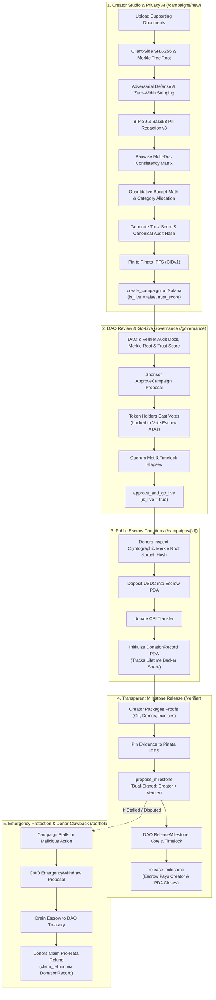

# arthasetu (अर्थसेतु)

A decentralized, privacy-verified milestone crowdfunding DAO on **Solana**. Creators launch campaigns backed by non-custodial stablecoin escrows; an in-memory, privacy-preserving AI diligence engine evaluates supporting documents, cross-examines the project story against technical whitepapers and budget spreadsheets, and produces a cryptographically bound on-chain **Trust Score**; an on-chain DAO approves campaigns, releases milestone tranches upon dual-signer deliverable verification, and enforces donor clawback protections.

Built with [Anchor](https://www.anchor-lang.com/) (Rust), Next.js 16 (React 19), `@solana/kit`, Pinata IPFS, Google Gemini, and a [Codama](https://github.com/codama-idl/codama)-generated TypeScript client.

---

## 🏛️ How It Works



---

## 🌟 Key Capabilities

### 🛡️ Hardened Privacy-Focused AI & Diligence Engine v3
* **Adversarial Input Defense**: Strips zero-width and invisible unicode characters (`\u200B`, `\uFEFF`, etc.), removes hidden HTML/Markdown comment injections (`<!-- ignore instructions ... -->`), and detects keyword stuffing repetition anomalies.
* **Privacy Redactor v3 with BIP-39 Verification**: Validates potential 12/24-word seed phrases against the canonical 2,048-word BIP-39 English dictionary before redacting (preventing false positives). Verifies Solana Base58 private keys, EVM 64-hex keys, JWT tokens, Indian PAN cards, SSNs, IBANs, Credit Cards, Emails, and Phone Numbers in-memory.
* **Cryptographic Document Merkle Trees**: Computes a deterministic 32-byte SHA-256 Merkle root across all uploaded documents, independent of upload order.
* **Canonical SHA-256 Audit Binding Hash**: Produces a tamper-proof digest (`0x...`) binding creator pubkey, document Merkle root, funding goal, Trust Score, and sub-scores.
* **Quantitative Budget & Category Allocation Engine**: Parses tabular cost entries into **Engineering**, **Security & Audits**, **Infrastructure**, **Operations/Legal**, and **Marketing**, computing percentage distributions and flagging category imbalances.
* **Pairwise Multi-Document Consistency Matrix**: Compares multiple attached files against each other (e.g., Whitepaper vs. Budget vs. Story) to detect runtime contradictions or unbudgeted deliverables.
* **Dual Privacy Modes**:
  * **100% Air-Gapped Local Mode**: Performs all diligence client-side using deterministic stylometrics, domain ontologies, and heuristic rules with 0 outbound network requests.
  * **Stateless Zero-Retention Cloud Mode**: Calls ephemeral LLM auditing with strict `Cache-Control: no-store` headers and immediate in-memory purging.

### 📌 Pinata Cloud IPFS & Multi-Gateway Resolution
* **Automatic Document Pinning**: Whitepapers, pitch decks, budget sheets, and deliverable evidence files are pinned to Pinata IPFS.
* **Multi-Gateway Fallback**: Resolves content seamlessly across Dedicated Pinata Gateways, Cloudflare IPFS, `ipfs.io`, and `dweb.link`.
* **Deterministic Offline Engine**: Falls back to deterministic SHA-256 base32 CIDv1 addressing if no Pinata API keys are supplied.

### ⚡ Performance & Image LCP Optimization
* **Next.js Image Architecture**: All campaign cards, exploration grids, creator previews, and hero banners use `<Image />` with `priority` on above-the-fold elements and responsive `sizes` to maximize Largest Contentful Paint (LCP) performance.
* **Remote Patterns Whitelist**: Pre-configured remote patterns for Unsplash, Pinata gateways, and IPFS endpoints.

### 📝 Rich GitHub Flavored Markdown (GFM)
* Full markdown story rendering with custom typography, code blocks, task lists (`- [x]`), blockquotes, and tables.
* Live **"Write (Markdown)"** vs. **"Preview"** tab toggle in the Campaign Creation Studio.
* Public **Deliverable Proof Inspector** modal rendering verified test reports and evidence links in rich markdown.

---

## 🌍 UN Sustainable Development Goals (SDGs)

Arthasetu is engineered to advance the **United Nations 2030 Sustainable Development Agenda**:

* **[SDG 16: Peace, Justice, & Strong Institutions](docs/SDG_ALIGNMENT.md#sdg-16-peace-justice-and-strong-institutions-primary)** (*Target 16.5 & 16.6*): Eliminates charity embezzlement and fund diversion through non-custodial smart contract escrows and decentralized governance voting.
* **[SDG 9: Industry, Innovation, & Infrastructure](docs/SDG_ALIGNMENT.md#sdg-9-industry-innovation-and-infrastructure-primary)** (*Target 9.1 & 9.c*): High-speed, decentralized public goods funding on Solana with privacy-preserving AI document diligence.
* **[SDG 13: Climate Action & Disaster Relief](docs/SDG_ALIGNMENT.md#sdg-13-climate-action--disaster-resilience-primary)** (*Target 13.1*): Rapid, borderless stablecoin mobilization for climate crises (e.g. Assam Flood Relief) with cryptographic field delivery verification.
* **[SDG 10: Reduced Inequalities](docs/SDG_ALIGNMENT.md#sdg-10-reduced-inequalities--remittance-friction-primary)** (*Target 10.c*): Reduces cross-border donation and remittance friction from 5–15% down to sub-cent Solana transaction costs (<$0.0005).
* **[SDG 17: Partnerships for the Goals](docs/SDG_ALIGNMENT.md#sdg-17-partnerships-for-the-goals-primary)** (*Target 17.17*): Fosters collaborative partnerships between grassroots NGOs, independent field auditors, and global DAO governance.

👉 **Read the full [UN SDG Alignment Analysis](docs/SDG_ALIGNMENT.md)** for detailed target breakdowns, KPIs, and impact matrices.

---

## 📚 Centralized Documentation Hub

All comprehensive architecture, security, operational, and technical guides are centralized in the **[`docs/`](docs/)** directory:

| Guide | Description |
| :--- | :--- |
| **[🌍 UN SDG Alignment](docs/SDG_ALIGNMENT.md)** | Deep dive into how Arthasetu advances UN SDGs 16, 9, 13, 10, and 17. |
| **[🏛️ System Architecture](docs/ARCHITECTURE.md)** | Full smart contract architecture, Solana PDA account map, and Pinata IPFS schemas. |
| **[📖 Operational Runbook](docs/RUNBOOK.md)** | End-to-end operational guide, local validator setup, and deployment walkthrough. |
| **[🛡️ Security Analysis](docs/SECURITY.md)** | Security guarantees, audit findings resolution log (C1–C5, H1–H8, M1–M11, L1–L5). |
| **[🧠 Privacy AI & Diligence Engine](docs/AI_AND_IPFS.md)** | In-memory text parsing, Merkle trees, BIP-39 redaction, budget math, and IPFS gateways. |

---

## 📁 Project Structure

```
├── app/
│   ├── admin/                # Protocol bootstrap, tokenomics, faucet & pause controls
│   ├── api/
│   │   ├── ai/audit/         # Next.js API route for Privacy AI Trust Scoring (Gemini & In-Memory)
│   │   └── pinata/upload/    # Next.js API route for Pinata file & JSON metadata pinning
│   ├── campaigns/
│   │   ├── [id]/             # Campaign details, donor cryptographic inspector, deliverable proofs
│   │   └── new/              # 5-step wizard with document dropzone, privacy mode switch & AI engine
│   ├── components/           # UI components, navbar, providers, cluster & wallet context
│   │   ├── fydao/            # Campaign cards, proposal cards, milestone dialogs, badges
│   │   └── markdown-content.tsx # GitHub Flavored Markdown renderer (headings, code, tables)
│   ├── explore/              # Public escrow discovery, category filtering, search & stats
│   │   └── fydao/            # Codama-generated typed program client (@solana/kit)
│   ├── governance/           # Governor hub: proposals, voting, timelock queue & token unlock
│   ├── lib/                  # AI audit service, Merkle trees, PII redactor, budget validator
│   ├── portfolio/            # Backer portfolio, donation receipts & emergency refund claimer
│   └── verifier/             # Designated verifier portal & deliverable proof builder
├── anchor/
│   ├── programs/fydao/       # The fydao Anchor governance & escrow program (Rust)
│   │   ├── src/instructions/ # 20 Anchor instruction handlers & execution gate
│   │   └── tests/            # Rust unit & LiteSVM on-chain integration tests
│   ├── Architecture.md       # Full smart contract architecture, state PDAs, trust model
│   └── Security.md           # Security audit findings & resolution log
├── scripts/
│   └── test-privacy-ai.ts    # 32-test automated unit and regression test suite for Privacy AI
├── codama.json               # Codama client generation config
└── package.json
```

---

## 🚀 Getting Started

### 1. Install Dependencies
```shell
npm install --legacy-peer-deps
```

### 2. Configure Environment Variables (Optional)
Copy `.env.example` to `.env.local` and add your API keys:
```bash
cp .env.example .env.local
```

```env
# Pinata IPFS API
PINATA_JWT="your_pinata_jwt_token_here"
NEXT_PUBLIC_PINATA_GATEWAY="https://gateway.pinata.cloud/ipfs/"

# Google Gemini API for AI Trust Scoring
GEMINI_API_KEY="your_gemini_api_key_here"
```

### 3. Build Smart Contract & Generate Client
```shell
npm run setup
```

### 4. Start Next.js Development Server
```shell
npm run dev
```

Open [http://localhost:3000](http://localhost:3000) to explore the dApp.

---

## 🛠️ Stack

| Layer | Technology |
| :--- | :--- |
| **Frontend** | Next.js 16 (App Router), React 19, TypeScript, Next Image Optimization |
| **Styling & UI** | Tailwind CSS v4, shadcn/ui, Lucide Icons |
| **Markdown Engine** | `react-markdown`, `remark-gfm` (GitHub Flavored Markdown) |
| **Solana SDK** | `@solana/kit`, `@wallet-standard/app`, `@wallet-standard/features` |
| **Program Client** | Codama-generated typed client (`@codama/cli`) |
| **Smart Contract** | Anchor 0.30.1 (Rust) on Solana Virtual Machine (SVM) |
| **Privacy AI Diligence**| Zero-Retention In-Memory Engine, Merkle Trees, BIP-39 Redactor, Gemini 1.5 Flash |
| **Storage & Proofs** | Pinata Cloud IPFS API + Multi-Gateway Resolution |

---

## 🧪 Testing

### 1. Automated Privacy AI & Diligence Test Suite
Run the 32-test TypeScript verification suite:
```bash
npx tsx scripts/test-privacy-ai.ts
```

### 2. On-Chain Smart Contract Tests
Rust unit and **on-chain LiteSVM integration tests** verify the smart contracts against a real in-process Solana Virtual Machine:
```bash
cargo test --manifest-path anchor/Cargo.toml
```

---

## 📜 Deployment Checklist

1. Set your Solana CLI to the target cluster (`solana config set --url devnet`).
2. Sync program keypair:
   ```bash
   cd anchor
   anchor keys sync
   anchor build
   anchor deploy
   cd ..
   npm run setup
   ```
3. Set `GENESIS_AUTHORITY` in `anchor/programs/fydao/src/lib.rs` to the deployer key before production bootstrap.
