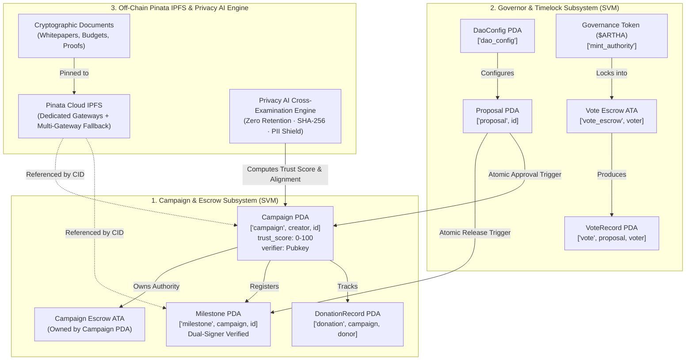

# 🏛️ Arthasetu (`fydao`) Protocol Runbook & Deployment Guide

> **Decentralized Milestone Crowdfunding DAO on Solana**  
> *Non-Custodial Escrows · Privacy AI Story-Doc Cross-Examination · Pinata Cloud IPFS · Dual-Signer Verification · Anti-Buy-Vote-Dump Governance · Pro-Rata Donor Clawbacks*

---

## 📑 Table of Contents

1. [System Architecture & On-Chain Account Map](#1-system-architecture--on-chain-account-map)
2. [Prerequisites & Environment Setup](#2-prerequisites--environment-setup)
3. [Building & Deploying the Smart Contracts](#3-building--deploying-the-smart-contracts)
4. [Client Generation & Frontend Setup](#4-client-generation--frontend-setup)
5. [End-to-End Operational Lifecycle Runbook](#5-end-to-end-operational-lifecycle-runbook)
   - [Phase 1: Protocol Bootstrap (`/admin`)](#phase-1-protocol-bootstrap-admin)
   - [Phase 2: Campaign Creation, Pinata IPFS Pinning & Story-Doc Cross-Examination (`/campaigns/new`)](#phase-2-campaign-creation-pinata-ipfs-pinning--story-doc-cross-examination-campaignsnew)
   - [Phase 3: DAO Member Review & Go-Live Governance (`/governance` & `/verifier`)](#phase-3-dao-member-review--go-live-governance-governance--verifier)
   - [Phase 4: Public Funding & USDC Donations (`/campaigns/[id]`)](#phase-4-public-funding--usdc-donations-campaignsid)
   - [Phase 5: Milestone Deliverable Verification & Transparent Release (`/verifier` & `/campaigns/[id]`)](#phase-5-milestone-deliverable-verification--transparent-release-verifier--campaignsid)
   - [Phase 6: Donor Impact & Emergency Refund Clawback (`/portfolio`)](#phase-6-donor-impact--emergency-refund-clawback-portfolio)
6. [Security & Trust Guarantees Checklist](#6-security--trust-guarantees-checklist)
7. [CLI & JSON-RPC Query Cheat Sheet](#7-cli--json-rpc-query-cheat-sheet)

---

## 1. System Architecture & On-Chain Account Map

Arthasetu is structured into three interlocking subsystems executed on the Solana Virtual Machine (SVM) and decentralized infrastructure:



### On-Chain PDA Seeds Summary

| Account | PDA Seeds | Authority / Owner | Description |
| :--- | :--- | :--- | :--- |
| `DaoConfig` | `["dao_config"]` | Program | Canonical governance rules (quorum, timelock delay, voting period, proposal threshold, max supply). |
| `Campaign` | `["campaign", creator, campaign_id]` | Program | Campaign state (trust score, total deposited, total released, milestone count, verifier key). |
| `Milestone` | `["milestone", campaign, milestone_id]` | Program | Deliverable proof CID, tranche amount, released flag. Closed upon payout. |
| `Proposal` | `["proposal", proposal_id]` | Program | Governance action payload, vote tallies, supply snapshot, timelock ETA. |
| `VoteRecord` | `["vote", proposal, voter]` | Program | Cast vote receipt (`For`, `Against`, `Abstain`), locked weight. Closed upon `unlock_votes`. |
| `DonationRecord` | `["donation", campaign, donor]` | Program | Cumulative donor contributions. Powers pro-rata emergency refund clawbacks (M4). |
| `Vote Escrow ATA` | `["vote_escrow", voter]` | Program PDA | Dedicated per-voter token account locking governance tokens during active votes. |

---

## 2. Prerequisites & Environment Setup

### 2.1 Required Tools

| Tool | Version | Purpose |
| :--- | :--- | :--- |
| **Rust** | `1.80+` | Rust compiler for Anchor smart contracts. |
| **Solana CLI** | `1.18+` or `2.0+` | Solana local validator and keypair management. |
| **Anchor CLI** | `0.30.1` | Solana smart contract build and test framework. |
| **Node.js** | `20.x` or `22.x` | JavaScript/TypeScript runtime. |
| **npm** or **pnpm** | `10+` | Package manager. |

### 2.2 Environment Configuration (`.env.local`)

Copy `.env.example` to `.env.local` to enable live Pinata IPFS pinning and Google Gemini AI audits:

```bash
cp .env.example .env.local
```

```env
# Pinata IPFS Credentials
# Create an account at https://app.pinata.cloud/ -> API Keys -> Create Key
PINATA_JWT="eyJhbGciOiJIUzI1NiIsInR5cCI6IkpXVCJ9..."
NEXT_PUBLIC_PINATA_GATEWAY="https://gateway.pinata.cloud/ipfs/"

# Google Gemini API Key for Privacy-Preserving AI Trust Scoring
# Get a free API key at https://aistudio.google.com/
GEMINI_API_KEY="AIzaSy..."
```

*(Note: If no API keys are provided, the protocol automatically operates in deterministic offline mode using browser WebCrypto SHA-256 and fallback heuristic scoring).*

---

## 3. Building & Deploying the Smart Contracts

### 3.1 Start Local Solana Test Validator
Open a dedicated terminal window:
```bash
solana-test-validator --reset
```

### 3.2 Build the Anchor Program
```bash
cd anchor
anchor build
```

The build process produces:
- Target binary: `anchor/target/deploy/fydao.so`
- Program Keypair: `anchor/target/deploy/fydao-keypair.json`
- IDL JSON: `anchor/target/idl/fydao.json`

### 3.3 Deploy to Localnet or Devnet
```bash
# Deploy on Localnet
anchor deploy --provider.cluster localnet

# Or Deploy to Solana Devnet
solana config set --url devnet
solana airdrop 5 $(solana address)
anchor deploy --provider.cluster devnet
```

---

## 4. Client Generation & Frontend Setup

### 4.1 Generate TypeScript Codama Client
Whenever smart contract instructions or account schemas change:
```bash
npx @codama/cli run
```
This generates typed account fetchers, PDA derivation helpers, and instruction builders in `app/generated/fydao/`.

### 4.2 Start the Next.js Frontend
```bash
npm install --legacy-peer-deps
npm run dev
```
Open your browser at **[http://localhost:3000](http://localhost:3000)**.

---

## 5. End-to-End Operational Lifecycle Runbook

### Phase 1: Protocol Bootstrap (`/admin`)

1. Navigate to **[http://localhost:3000/admin](http://localhost:3000/admin)**.
2. Connect your **Genesis Authority** wallet (matching `GENESIS_AUTHORITY`).
3. Under **Tab 1 (Bootstrap & Config)**:
   - Click **"Create Governance Mint"** (creates SPL Token Mint for `$ARTHA`).
   - Click **"Create Treasury ATA"** (creates canonical treasury token account).
   - Click **"Initialize DAO Program"** (creates on-chain `DaoConfig` PDA with voting delay, 40% quorum, and 1-hour timelock).
4. Under **Tab 2 (Tokenomics)**:
   - Click **"Initialize Metaplex Token Metadata"** (binds Symbol `ARTHA` and IPFS icon).
   - Enter `10000` and click **"Mint to Operator Wallet"** to fund your wallet with voting power.
5. Under **Tab 3 (Test Faucet)**:
   - Click **"Create Mock USDC Mint"**.
   - Click **"Mint 100,000 Test USDC"** to fund test wallets for campaign donations.

---

### Phase 2: Campaign Creation, Pinata IPFS Pinning & Story-Doc Cross-Examination (`/campaigns/new`)

1. Navigate to **[http://localhost:3000/campaigns/new](http://localhost:3000/campaigns/new)**.
2. **Step 1 · Identity & Branding**:
   - Enter Campaign Title, Tagline, Category (`Technology`, `DeFi`, `Climate`, etc.).
   - Provide banner image URL and project links (GitHub, Website, Twitter).
3. **Step 2 · Docs & Privacy AI Audit**:
   - Drop supporting documents (Whitepaper, Budget Sheet, Pitch Deck, Tech Specs).
   - Each file is automatically uploaded and pinned to **Pinata Cloud IPFS** with its **SHA-256 checksum** displayed.
   - Click **"Run AI Audit & Scoring"** to execute the zero-retention Privacy AI Engine.
   - Inspect the **Trust Score (0–100)** and 5 sub-scores:
     - *Authenticity Score*
     - *Story vs. Document Alignment Score*
     - *Feasibility Score*
     - *Verifiability Score*
     - *AI Content & Spam Risk*
   - Review the **Story vs. Document Cross-Examination** panel for verified alignments and discrepancy alerts.
   - (Optional) Click **"Apply Milestones"** to auto-populate milestone tranches suggested by AI.
4. **Step 3 · Story & Milestone Roadmap**:
   - Write or refine the project story using rich **GitHub Flavored Markdown (GFM)**.
   - Switch between **"Write (Markdown)"** and **"Preview"** tabs to verify formatting.
   - Configure planned milestone release tranches (supports 1 to N milestones).
   - When advancing to Step 4, the system automatically re-evaluates the updated story against your uploaded documents.
5. **Step 4 · Funding Target & Designated Verifier**:
   - Specify target funding in USDC (e.g. `25,000 USDC`).
   - The AI Trust Score is automatically locked into the on-chain submission payload.
   - Set **Designated Verifier Solana Address** (auditor, DAO technical committee key, or creator's wallet).
6. **Step 5 · Review & Launch**:
   - Inspect verified document checksums, Pinata IPFS links, and AI cross-examination summaries.
   - Click **"Sign & Launch Campaign"** (uploads `CampaignMetadata` JSON to Pinata IPFS and creates the on-chain `Campaign` PDA on Solana with `is_live = false`).

---

### Phase 3: DAO Member Review & Go-Live Governance (`/governance` & `/verifier`)

1. Newly created campaigns start in an unapproved state (`is_live = false`).
2. Assigned DAO members and designated verifiers open **[http://localhost:3000/verifier](http://localhost:3000/verifier)** or **[http://localhost:3000/campaigns/[id]](http://localhost:3000/campaigns/[id])**.
3. Review the rich Markdown Campaign Story, uploaded document checksums, Pinata links, and AI Trust Audit findings.
4. Click **"Sponsor DAO Vote"** to create an on-chain `ApproveCampaign` proposal.
5. Community members vote (`Vote For`, `Vote Against`, `Abstain`) with tokens locked in vote-escrow ATAs.
6. Once passed and the timelock delay elapses, click **"Execute Action Now"** (`approve_and_go_live`), activating public donations.

---

### Phase 4: Public Funding & USDC Donations (`/campaigns/[id]`)

1. Navigate to **[http://localhost:3000/explore](http://localhost:3000/explore)** and click on the newly live campaign.
2. Inspect the **Hero Header & Audit Tab**:
   - On-chain AI Trust Score badge (0–100) and 5 audit sub-scores.
   - Story vs. Document Cross-Examination findings.
   - Verified supporting documents with direct Pinata IPFS gateway links.
   - Escrow accounting bar (Total Raised, Released to Creator, Locked in Vault).
3. **Back the Campaign**:
   - Select a preset amount chip (`$50`, `$100`, `$250`, `$500`) or enter a custom USDC amount.
   - Click **"Donate USDC to Escrow"**.
   - The transaction transfers stablecoins from the donor into the Campaign PDA's non-custodial Associated Token Account and initializes/increments the donor's on-chain `DonationRecord` PDA.

---

### Phase 5: Milestone Deliverable Verification & Transparent Release (`/verifier` & `/campaigns/[id]`)

1. When deliverables for Milestone #1 are complete, navigate to **[http://localhost:3000/verifier](http://localhost:3000/verifier)**.
2. Open the **"Proof Builder"** tab:
   - Enter Milestone Title, summary of deliverables, git commit hash, live deployment URL, and test report links.
   - Attach deliverable files via the **"Upload File to Pinata"** button.
   - Click **"Package & Pin to IPFS"** to generate the `proof_cid`.
3. Switch to the **"Assigned to Me"** tab (using the connected designated verifier wallet):
   - Click **"Attest Next Milestone"**.
   - Paste the `proof_cid` and tranche release amount (e.g. `5,000 USDC`).
   - Click **"Attest & Create Milestone PDA"**.
   - The on-chain `propose_milestone` instruction verifies dual-signatures (Creator + Verifier) and registers the `Milestone` PDA on Solana.
4. **DAO Release Vote**:
   - Sponsoring members create a `ReleaseMilestone` proposal in **[http://localhost:3000/governance](http://localhost:3000/governance)**.
   - Community votes with locked tokens.
   - Upon timelock completion, permissionless trigger `release_milestone` atomically pays the creator and closes the milestone PDA.
5. **Donor Deliverable Proof Inspector**:
   - Donors open the campaign page `/campaigns/[id]` and click **"Inspect Proof"** on the milestone to view the verified git commits, live demo URLs, and cryptographic verifier attestations rendered in rich GitHub Flavored Markdown.

---

### Phase 6: Donor Impact & Emergency Refund Clawback (`/portfolio`)

1. Navigate to **[http://localhost:3000/portfolio](http://localhost:3000/portfolio)**.
2. View your **Backer Impact Portfolio**:
   - Lifetime contributed USDC across all projects.
   - Milestones unlocked and deliverable receipts.
   - Click **"View Receipt"** to view and copy cryptographic proof of donation on Solana.
3. **Emergency Refund Clawback (Audit M4)**:
   - If a campaign fails or acts maliciously, the DAO passes an `EmergencyWithdraw` proposal.
   - When the donor opens `/portfolio`, the **Automated Refund Scanner** alerts them with an **"Emergency Refund Available"** banner.
   - The donor clicks **"Claim Pro-Rata Refund Now"** (`claim_refund`), returning their pro-rata share of remaining escrow funds directly to their wallet.

---

## 6. Security & Trust Guarantees Checklist

| Audit Item | Mechanism | Implementation Guarantee |
| :--- | :--- | :--- |
| **M1: Authority Transfer** | 2-Step Handover | `transfer_authority` only sets `pending_authority`. New key must call `accept_authority`. |
| **M2: Escrow Ownership** | Non-Custodial PDA | Campaign funds are held in an ATA owned by `["campaign", creator, id]`. No single key can drain funds. |
| **M3: Flash-Loan Resistance** | Vote Token Escrow | `cast_vote` locks tokens in `["vote_escrow", voter]` until proposal is terminal. |
| **M4: Donor Recourse** | Pro-Rata Clawbacks | Lifetime contributions tracked via `DonationRecord` PDAs allow backers to claim refunds if drained. |
| **M5: Attestation Rigor** | Dual-Signer Validation | `propose_milestone` requires explicit signatures from both Creator and Designated Verifier. |
| **M6: Timelock Safety** | Cool-Off Buffers | Succeeded proposals must wait for `timelock_delay` before permissionless execution can trigger. |
| **M7: Privacy Diligence** | Zero-Retention AI | Documents are hashed client-side with SHA-256, sanitized for PII, and cross-examined without central storage. |

---

## 7. CLI & JSON-RPC Query Cheat Sheet

### Query Campaign State via Solana CLI
```bash
# Query Campaign PDA account data
solana account <CAMPAIGN_PDA_ADDRESS>

# Query Token Account balance of Campaign Escrow
spl-token balance --address <CAMPAIGN_ESCROW_ATA>
```

### Inspect IPFS Deliverable Metadata via Pinata Gateway
```bash
# Fetch Campaign Metadata
curl -s "https://gateway.pinata.cloud/ipfs/<CAMPAIGN_METADATA_CID>" | jq .

# Fetch Milestone Deliverable Proof
curl -s "https://gateway.pinata.cloud/ipfs/<MILESTONE_PROOF_CID>" | jq .
```

---

*Arthasetu Protocol Documentation · Built on Solana SVM & Anchor.*
