# 🧠 Privacy-Focused AI Diligence & Pinata IPFS Architecture

> **Deep Dive: In-Memory Text Parsing, PII Sanitization, Story vs. Document Cross-Examination, and Pinata Cloud IPFS Integration.**

---

## 📑 Table of Contents
1. [Privacy-Preserving AI Architecture](#1-privacy-preserving-ai-architecture)
2. [Client-Side SHA-256 Hashing & In-Memory Extraction](#2-client-side-sha-256-hashing--in-memory-extraction)
3. [PII Sanitization Shield](#3-pii-sanitization-shield)
4. [Story vs. Document Cross-Examination](#4-story-vs-document-cross-examination)
5. [5-Pillar Trust Scoring Mathematical Model](#5-5-pillar-trust-scoring-mathematical-model)
6. [Pinata Cloud IPFS Integration & Dedicated Gateways](#6-pinata-cloud-ipfs-integration--dedicated-gateways)

---

## 1. Privacy-Preserving AI Architecture

```mermaid
sequenceDiagram
    autonumber
    actor Creator as 🧑‍💻 Campaign Creator (Browser)
    participant WebCrypto as 🔐 WebCrypto API
    participant Pinata as 📦 Pinata IPFS Cloud
    participant Redactor as 🛡️ PII Sanitizer
    participant AI as 🧠 Gemini 1.5 Flash AI
    participant Solana as ⛓️ Solana SVM (Anchor)

    Creator->>WebCrypto: Hash Documents (Whitepapers & Budgets)
    WebCrypto-->>Creator: Returns SHA-256 Fingerprints
    Creator->>Pinata: Upload Raw Files to IPFS (/api/pinata/upload)
    Pinata-->>Creator: Returns Pinata CIDs (bafy...)

    Creator->>Redactor: Extract In-Memory Text & Sanitize
    Redactor->>Redactor: Strip Emails, Phones & Private Keys
    Redactor->>AI: Send Sanitized Text + Hashes + Story Markdown

    rect rgb(20, 30, 40)
        Note over AI: Multi-Vector Diligence Analysis
        AI->>AI: Cross-Examine Story Claims vs Document Specs
        AI->>AI: Assess Budget Feasibility vs Market Rates
        AI->>AI: Evaluate Deliverable Verifiability Criteria
        AI->>AI: Detect Generic AI Spam & Hallucination Risks
    end

    AI-->>Creator: Returns AI Audit Report (Trust Score: 0-100, Alignment Sub-scores)
    Creator->>Solana: create_campaign(metadata_cid, trust_score, verifier)
    Solana-->>Solana: Initializes Campaign PDA with immutable trust_score
```



---

## 2. Client-Side SHA-256 Hashing & In-Memory Extraction

* **Cryptographic Fingerprinting**:
  Before any document is transmitted, WebCrypto calculates a SHA-256 digest in the browser:
  ```typescript
  export async function computeFileHash(file: File): Promise<string> {
    const buffer = await file.arrayBuffer();
    const digestBuffer = await crypto.subtle.digest("SHA-256", buffer);
    const hashArray = Array.from(new Uint8Array(digestBuffer));
    return hashArray.map((b) => b.toString(16).padStart(2, "0")).join("");
  }
  ```
* **Zero Data Retention**:
  Document text is extracted in memory buffers and never stored on a centralized database or disk.

---

## 3. PII Sanitization Shield

To protect creator identity and prevent leakage of private keys or personal credentials, a regex redaction filter runs before the text is inspected by the AI auditor:

```typescript
export function sanitizeTextForPrivacy(text: string): string {
  return text
    .replace(/[a-zA-Z0-9._%+-]+@[a-zA-Z0-9.-]+\.[a-zA-Z]{2,}/g, "[EMAIL_REDACTED]")
    .replace(/(?:\+?\d{1,3}[-.\s]?)?\(?\d{3}\)?[-.\s]?\d{3}[-.\s]?\d{4}/g, "[PHONE_REDACTED]")
    .replace(/0x[a-fA-F0-9]{64}/g, "[PRIVATE_KEY_REDACTED]")
    .replace(/[1-9A-HJ-NP-Za-km-z]{64,}/g, "[SECRET_REDACTED]");
}
```

---

## 4. Story vs. Document Cross-Examination

The AI engine performs a cross-examination comparing the **Campaign Story Markdown Description** against the **Uploaded Documents (Whitepaper, Itemized Budget, Tech Specs)**:

1. **Thematic & Technical Alignment**:
   Checks whether technical claims in the story (e.g. Solana programs, zk-proofs, oracle feeds) are substantiated by the architecture sections in the uploaded whitepaper.
2. **Budget Coherence**:
   Asserts that the funding goal and milestone costs in the story match the line items in the uploaded budget sheet.
3. **Discrepancy & Contradiction Detection**:
   Flags mismatched funding figures or conflicting architectural claims (e.g. story targeting Solana while whitepaper discusses EVM contracts).

---

## 5. 5-Pillar Trust Scoring Mathematical Model

The composite on-chain **Trust Score ($T \in [0, 100]$)** is calculated using a weighted composite formula:

$$T = \text{round}\Big(0.25 \cdot A_{\text{auth}} + 0.25 \cdot A_{\text{align}} + 0.20 \cdot F_{\text{feas}} + 0.20 \cdot V_{\text{verif}} + 0.10 \cdot S_{\text{ai}}\Big)$$

Where:
* $A_{\text{auth}}$ = **Document Authenticity Score (0–100)**: Document consistency, valid formats, and identity coherence.
* $A_{\text{align}}$ = **Story vs. Document Alignment Score (0–100)**: Degree of concordance between story narrative and document contents.
* $F_{\text{feas}}$ = **Budget Feasibility Score (0–100)**: Realism of requested funding relative to market development/procurement costs.
* $V_{\text{verif}}$ = **Deliverable Verifiability Score (0–100)**: Objectivity and testability of milestone acceptance criteria (Git commits, LiteSVM test suites, GPS logs).
* $S_{\text{ai}}$ = **Human/Engineering Depth Score (0–100)**: Inversely proportional to generic AI filler/template probability ($100 - 0.7 \times P_{\text{ai}}$).

---

## 6. Pinata Cloud IPFS Integration & Dedicated Gateways

### 6.1 Server-Side Upload Route (`/api/pinata/upload`)
Handles multipart file uploads and JSON metadata pinning using Pinata Cloud REST endpoints:
* `https://api.pinata.cloud/pinning/pinFileToIPFS`
* `https://api.pinata.cloud/pinning/pinJSONToIPFS`

### 6.2 Multi-Gateway Resolution
Metadata and deliverable evidence files are resolved across multiple gateways with automatic fallback:
1. `https://gateway.pinata.cloud/ipfs/` (Dedicated Pinata Gateway)
2. `https://ipfs.io/ipfs/`
3. `https://cloudflare-ipfs.com/ipfs/`
4. `https://dweb.link/ipfs/`

---

*Arthasetu Protocol AI & IPFS Documentation · Zero-Retention Privacy Diligence.*
