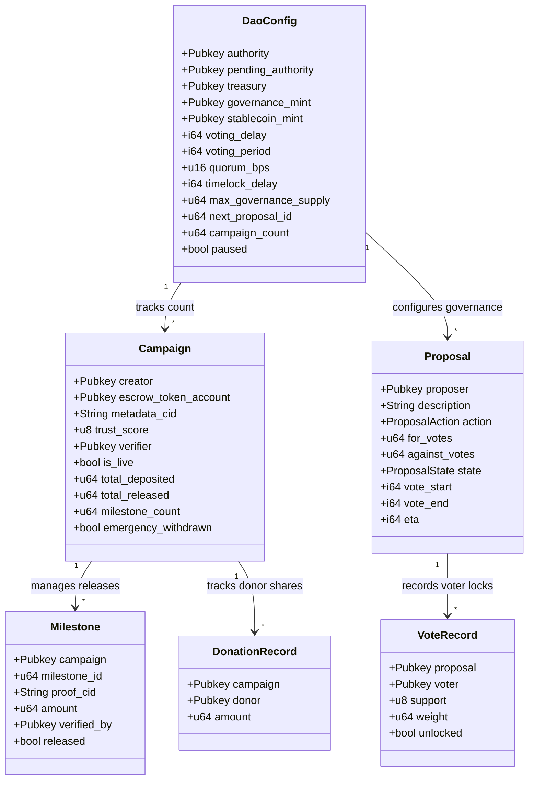
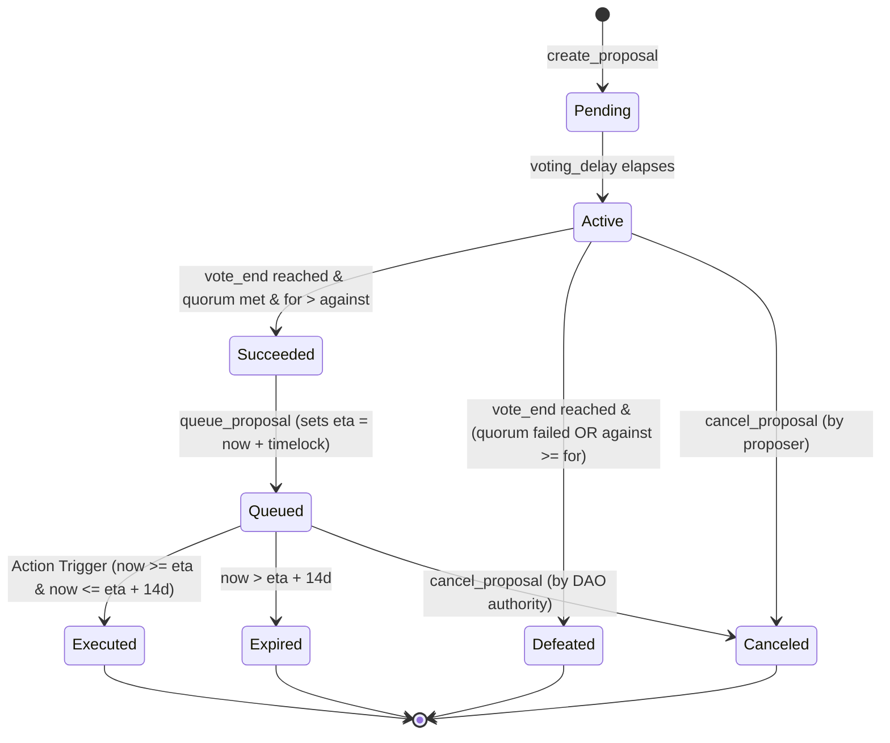

# 🏛️ Arthasetu (`fydao`) — Program Architecture

> **Comprehensive Solana Smart Contract, Account PDA Map, Governance Timelock, and Pinata IPFS Architecture.**

---

## 1. Overview

`fydao` is a Solana program written with the Anchor framework (Rust). It combines two subsystems in a single program:

1. **Fundraising / Escrow Subsystem** — creators open a *Campaign*, an in-memory Privacy AI engine hashes supporting documents with SHA-256, cross-examines the project story against technical whitepapers/budgets, and records an immutable *Trust Score* (0–100) and designated *Verifier* on Solana. Donors deposit a stablecoin into a PDA-owned escrow, and funds are released to the creator in *Milestones* upon dual-signer verification.
2. **Governance Subsystem (Governor-style)** — governance-token holders create *Proposals* carrying a typed `ProposalAction`, vote (locking tokens in per-voter escrow ATAs), and the action is performed by a permissionless trigger once the proposal passes, is queued, and its timelock delay elapses.

All source lives under `anchor/programs/fydao/src/`:

```
src/
├── lib.rs                    # declare_id! + top-level instruction dispatch
├── errors.rs                 # FydaoError
├── state/                    # all on-chain account structs + events
│   ├── dao_config.rs         # global protocol config (PDA)
│   ├── governance_token.rs   # governance token meta-state (PDA)
│   ├── campaign.rs           # campaign account (PDA)
│   ├── milestone.rs          # milestone account (PDA, closed on release)
│   ├── proposal.rs           # proposal account + ProposalState/ProposalAction enums (PDA)
│   ├── vote_record.rs        # per-voter vote receipt (PDA, closed on unlock)
│   ├── donation_record.rs    # per-donor contribution record (PDA)
│   └── events.rs             # Anchor #[event] structs (20 events)
└── instructions/             # one file per instruction + shared execution gate
    ├── initialize_dao.rs
    ├── initialize_governance_token.rs
    ├── mint_governance_tokens.rs
    ├── create_campaign.rs
    ├── approve_and_go_live.rs   # proposal-gated trigger
    ├── donate.rs
    ├── propose_milestone.rs
    ├── release_milestone.rs     # proposal-gated trigger; closes Milestone
    ├── emergency_withdraw.rs    # proposal-gated trigger
    ├── claim_refund.rs          # donor clawback after a drain (M4)
    ├── execution.rs             # finalize_execution (timelock + 14-day window gate)
    ├── create_proposal.rs
    ├── cast_vote.rs
    ├── unlock_votes.rs          # returns locked weight; closes VoteRecord
    ├── queue_proposal.rs
    ├── cancel_proposal.rs
    ├── transfer_authority.rs    # proposal-gated trigger (step 1)
    ├── accept_authority.rs      # step 2, signed by the new authority
    └── set_paused.rs            # emergency circuit breaker (authority-gated)
```

---

## 2. Program ID & Deployment Config

- **Program ID**: `HwV2YLJscqtHApqHj3Lp6cW4hA3L7areeWe1PH9BUSBb` in `lib.rs:9`.
- `anchor/Anchor.toml` declares `[programs.devnet] fydao = "HwV2YLJscqtHApqHj3Lp6cW4hA3L7areeWe1PH9BUSBb"` (also `[programs.localnet]`).
- `initialize_dao` is guarded by the pinned `GENESIS_AUTHORITY` constant (`lib.rs`) — set to the local dev wallet pubkey (the `[provider] wallet`) for the prototype; set it to the real deployer key before a production deployment (H1).

---

## 3. Account Model & On-Chain PDA Map

### 3.1 Entity-Relationship & PDA Topology Diagram



### 3.2 Proposal Lifecycle & Timelock State Machine



### 3.3 On-Chain PDA Accounts & Lifecycles

| Account             | Seeds                                                                   | Key fields                                             | Written by                                                      |
| ------------------- | ----------------------------------------------------------------------- | ------------------------------------------------------ | --------------------------------------------------------------- |
| `DaoConfig`         | `["dao_config"]`                                                        | authority, pending_authority, treasury, governance_mint, stablecoin_mint, voting params (voting_delay, voting_period, quorum_bps, proposal_threshold, timelock_delay), max_governance_supply, next_proposal_id, campaign_count, paused | `initialize_dao`, `create_campaign`, `create_proposal`, `transfer_authority`, `accept_authority` |
| `GovernanceTokenState` | `["gov_token"]`                                                      | bump, mint, authority, total_minted                     | `initialize_governance_token`, `mint_governance_tokens`          |
| `Campaign`          | `["campaign", creator, campaign_id]`                                    | creator, escrow_token_account, metadata_cid, trust_score, verifier, is_live, total_deposited, total_released, milestone_count, created_at, emergency_withdrawn | `create_campaign`, `approve_and_go_live`, `donate`, `propose_milestone`, `release_milestone`, `emergency_withdraw`, `claim_refund` |
| `Milestone`         | `["milestone", campaign, milestone_id]`                                 | campaign, milestone_id, proof_cid, amount, verified_by, released, proposed_at, released_at | `propose_milestone`, `release_milestone` (**closes**)            |
| `Proposal`          | `["proposal", proposal_id]`                                             | proposer, description, action (`ProposalAction`), total_votes_at_creation, for/against/abstain_votes, state, created_at, vote_start, vote_end, queued_at, eta, executed | `create_proposal`, `cast_vote`, `queue_proposal`, `cancel_proposal`, action triggers (`execution.rs`), `unlock_votes` |
| `VoteRecord`        | `["vote", proposal, voter]`                                             | proposal, voter, support, weight, voted_at, unlocked    | `cast_vote`, `unlock_votes` (**closes**)                         |
| `DonationRecord`    | `["donation", campaign, donor]`                                         | campaign, donor, amount (lifetime contributions)        | `donate`, `claim_refund`                                         |

**Escrow**: a classic SPL Token associated token account (`associated_token::authority = campaign`), i.e. the **Campaign PDA is the token authority** of the escrow. Transfers out of escrow use `CpiContext::new_with_signer(...)` with the campaign PDA seeds (`campaign` + creator + campaign_id + bump).

**Governance mint authority**: the program PDA `["mint_authority"]` (`GovernanceTokenState::MINT_AUTHORITY_SEED`) is granted the governance mint's `MintTo` authority at `initialize_governance_token`. It is a pure signer PDA (no data); it exists so the supply cap cannot be bypassed by a raw SPL `MintTo` (C5/H5).

---

## 4. Off-Chain Pinata IPFS & Metadata Schemas

### 4.1 Campaign Metadata Schema (`CampaignMetadata`)
Stored at `campaign.metadata_cid`:
```json
{
  "version": "1.1.0",
  "title": "Assam Flood Emergency Relief & Medical Aid 2026",
  "tagline": "Rapid water rescue, emergency rations, and mobile medical clinics",
  "category": "climate",
  "description": "# Project Story\n...",
  "targetFundingUsdc": "50000",
  "documents": [
    {
      "name": "Assam_State_Disaster_Report_2026.pdf",
      "type": "application/pdf",
      "size": 348200,
      "sha256": "8a1c93b74e1045df6a20183b54d389a01f782c3d4e5f60718293a4b5c6d7e8f9",
      "ipfsCid": "bafybeidoc1assamdisasterreport2026officialassessment",
      "category": "technical_spec"
    }
  ],
  "aiAudit": {
    "trustScore": 94,
    "rating": "Exceptional",
    "aiGeneratedRisk": "Low",
    "aiGeneratedProbability": 8,
    "subScores": {
      "authenticityScore": 96,
      "storyDocumentAlignmentScore": 95,
      "feasibilityScore": 92,
      "verifiabilityScore": 94,
      "aiContentScore": 95
    },
    "storyAlignmentFindings": [
      "Funding goal matches line items in budget document",
      "Target disaster zones match official disaster report"
    ],
    "storyDiscrepancies": [],
    "auditHash": "0x94f1c7e8a203b41d"
  },
  "plannedMilestones": [
    {
      "id": 0,
      "title": "Phase 1: Emergency Water Rescue & Food Rations",
      "description": "Deployment of 15 rescue rafts and 10,000 rations",
      "targetAmountUsdc": "20000",
      "estimatedDurationDays": 14
    }
  ],
  "creatorAddress": "7f9a...",
  "verifierAddress": "4u5b..."
}
```

---

## 5. Trust Model & Guarantees

- **DAO-Governed Fund Movement (C3)**: `approve_and_go_live`, `release_milestone`, `emergency_withdraw`, and `transfer_authority` are **permissionless triggers** that only act when the proposal they reference has passed, been queued, and its timelock delay has elapsed (`execution.rs::finalize_execution`). No single key—not even `dao_config.authority`—can move funds directly.
- **Privacy AI Diligence & Trust Score Binding**: Campaign creation binds an on-chain `trust_score` (0–100) computed from client-side SHA-256 hashed documents, zero-retention text parsing, and deep story-document cross-examination.
- **Governance Token Holders**: Vote with a *locked* token balance: `cast_vote` transfers the voted weight into a per-voter escrow ATA (owned by the `["vote_escrow", voter]` PDA) and `unlock_votes` returns it once the proposal reaches a final state.
- **Donors Recourse**: `donate` records contributions in a `DonationRecord`, and after a governance-approved `emergency_withdraw` the donor can `claim_refund` up to `min(record, escrow_remaining)`.
- **Dual-Signer Milestone Attestation**: `propose_milestone` requires explicit signatures from both Creator and Designated Verifier (`campaign.verifier`), ensuring deliverables are verified before DAO voting.

---

*Arthasetu Protocol Architecture · Built on Solana SVM & Anchor 0.30.1.*
