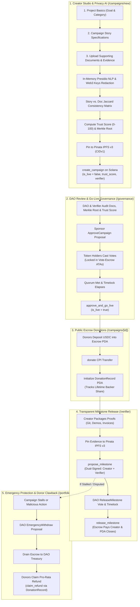

# 📚 Arthasetu (`अर्थसेतु`) Protocol Documentation Hub

Welcome to the centralized documentation hub for the **Arthasetu Protocol**, a decentralized, privacy-verified milestone crowdfunding DAO on **Solana**.

---

## 🧭 Documentation Map

| Document | Description |
| :--- | :--- |
| **[📊 Technical Comparison & Rationale](./COMPARISON_AND_EXPERIMENTS.md)** | Deep-dive EVM vs. Solana comparison, engineering rationale for all chosen technologies, and 8 verified empirical benchmarks. |
| **[🌍 UN SDG Alignment](./SDG_ALIGNMENT.md)** | Deep dive into how Arthasetu advances **SDG 16 (Peace, Justice & Strong Institutions)**, **SDG 9 (Innovation & Infrastructure)**, **SDG 13 (Climate Action)**, **SDG 10 (Reduced Inequalities)**, and **SDG 17 (Partnerships)**. |
| **[🏛️ System Architecture](./ARCHITECTURE.md)** | Complete smart contract architecture, Solana PDA account map, governance timelock loop, and Pinata IPFS schemas. |
| **[📖 Operational Runbook](./RUNBOOK.md)** | End-to-end operational guide: local validator setup, contract deployment, campaign launch, and milestone releases. |
| **[🛡️ Security Analysis](./SECURITY.md)** | Security guarantees, audit findings resolution log (C1–C5, H1–H8, M1–M11, L1–L5), and trust model. |
| **[🧠 Privacy AI & Pinata IPFS](./AI_AND_IPFS.md)** | Technical deep dive on in-memory zero-retention text parsing, PII sanitization, story-document cross-examination, and IPFS gateways. |

---

## 🌟 Key Architecture Highlights

---

*Arthasetu Protocol Documentation Hub · Built on Solana SVM & Anchor 0.30.1.*
