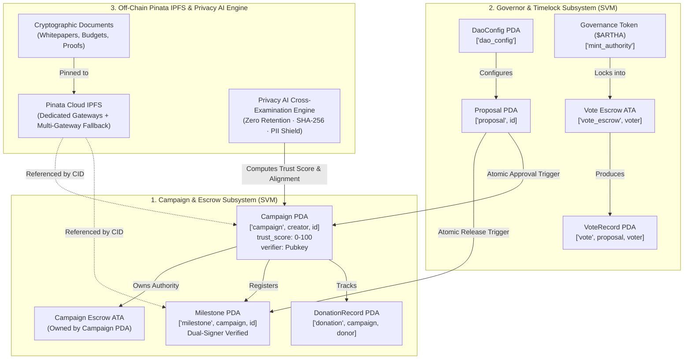

# 🏛️ Arthasetu (`fydao`) Protocol Runbook & Deployment Guide

> **Decentralized Milestone Crowdfunding DAO on Solana**  
> *Non-Custodial Escrows · Privacy AI Story-Doc Cross-Examination · Pinata Cloud IPFS · Dual-Signer Verification · Anti-Buy-Vote-Dump Governance · Pro-Rata Donor Clawbacks*

---

## 📑 Table of Contents

1. [System Architecture & On-Chain Account Map](#1-system-architecture--on-chain-account-map)
2. [Prerequisites & Environment Setup](#2-prerequisites--environment-setup)
3. [Building & Deploying the Smart Contracts](#3-building--deploying-the-smart-contracts)
4. [Client Generation & Frontend Setup](#4-client-generation--frontend-setup)
5. [End-to-End Operational Lifecycle Runbook](#5-end-to-end-operational-lifecycle-runbook)
   - [Phase 1: Protocol Bootstrap (`/admin`)](#phase-1-protocol-bootstrap-admin)
   - [Phase 2: Campaign Creation, Pinata IPFS Pinning & Story-Doc Cross-Examination (`/campaigns/new`)](#phase-2-campaign-creation-pinata-ipfs-pinning--story-doc-cross-examination-campaignsnew)
   - [Phase 3: DAO Member Review & Go-Live Governance (`/governance` & `/verifier`)](#phase-3-dao-member-review--go-live-governance-governance--verifier)
   - [Phase 4: Public Funding & USDC Donations (`/campaigns/[id]`)](#phase-4-public-funding--usdc-donations-campaignsid)
   - [Phase 5: Milestone Deliverable Verification & Transparent Release (`/verifier` & `/campaigns/[id]`)](#phase-5-milestone-deliverable-verification--transparent-release-verifier--campaignsid)
   - [Phase 6: Donor Impact & Emergency Refund Clawback (`/portfolio`)](#phase-6-donor-impact--emergency-refund-clawback-portfolio)
6. [Security & Trust Guarantees Checklist](#6-security--trust-guarantees-checklist)
7. [CLI & JSON-RPC Query Cheat Sheet](#7-cli--json-rpc-query-cheat-sheet)

---

## 1. System Architecture & On-Chain Account Map



---

## 2. Prerequisites & Environment Setup

### 2.1 Required Tools
* **Rust**: `1.80+` (Anchor smart contract compilation)
* **Solana CLI**: `1.18+` or `2.0+`
* **Anchor CLI**: `0.30.1`
* **Node.js**: `20.x` or `22.x`

### 2.2 Environment Configuration (`.env.local`)
Copy `.env.example` to `.env.local`:
```bash
cp .env.example .env.local
```

```env
# Pinata IPFS Credentials (v3 Files API)
PINATA_JWT="your_pinata_jwt_token_here"
NEXT_PUBLIC_PINATA_GATEWAY="https://bronze-changing-silverfish-206.mypinata.cloud/"

# Google Gemini API Key for Privacy-Preserving AI Trust Scoring
GEMINI_API_KEY="AIzaSy..."

# (Optional) Microsoft Presidio NLP De-Identification Services
# PRESIDIO_ANALYZER_URL="http://localhost:5001"
# PRESIDIO_ANONYMIZER_URL="http://localhost:5002"
```

### 2.3 Optional: Start Microsoft Presidio NLP Sidecar
To enable neural Named Entity Recognition (NER for names, physical locations, and national IDs) locally:
```bash
docker compose -f docker-compose.presidio.yml up -d
```

---

## 3. Building & Deploying the Smart Contracts

```bash
# 1. Build the Anchor program
cd anchor
anchor build

# 2. Deploy to Devnet / Localnet
anchor deploy --provider.cluster devnet
```

---

## 4. Client Generation & Frontend Setup

```bash
# 1. Generate TypeScript Codama client
npx @codama/cli run

# 2. Run Privacy AI & Diligence Test Suite (43 automated tests)
npx tsx scripts/test-privacy-ai.ts

# 3. Start Next.js development server
npm install --legacy-peer-deps
npm run dev
```

---

## 5. End-to-End Operational Lifecycle Runbook

### Phase 1: Protocol Bootstrap (`/admin`)
1. Connect **Genesis Authority** wallet at `/admin`.
2. Initialize Governance Token ($ARTHA), Treasury ATA, and `DaoConfig` PDA.
3. Mint test USDC tokens from the Test Faucet tab.

### Phase 2: Campaign Creation & Diligence (`/campaigns/new`)
1. **Step 1 (Basics)**: Enter Campaign title, category, funding target in USDC, and social links.
2. **Step 2 (Story)**: Author the campaign narrative and technical specification in rich GitHub Flavored Markdown (GFM) with live preview.
3. **Step 3 (Documents & Privacy AI)**:
   - Upload supporting documents (Whitepaper, Budget, FCRA registration); files are hashed with client-side SHA-256 and pinned via Pinata v3 (`https://uploads.pinata.cloud/v3/files`).
   - Run Privacy AI Diligence: Applies **Microsoft Presidio NLP** + **Web3 BIP-39/key redactor**, calculates the 5-factor **Trust Score (0–100)**, builds the **Document Merkle Tree**, and evaluates substantive Story-Document alignment.
4. **Step 4 (Milestones)**: Define deliverable tranches and assign the designated verifier pubkey.
5. **Step 5 (Review & Sign)**: Sign `create_campaign` on Solana (`is_live = false`).

### Phase 3: DAO Member Review & Go-Live Governance (`/governance`)
1. Review document hashes, Merkle root, and AI audit findings in `/verifier` or `/campaigns/[id]`.
2. Sponsor an on-chain `ApproveCampaign` proposal.
3. Token holders vote with tokens locked in `["vote_escrow", voter]` ATAs.
4. After timelock delay passes, permissionless trigger `approve_and_go_live` executes.

### Phase 4: Public Funding & USDC Donations (`/campaigns/[id]`)
1. Donors deposit USDC directly into the non-custodial Escrow PDA (`donate`).
2. Program initializes on-chain `DonationRecord` tracking lifetime contributions.

### Phase 5: Milestone Deliverable Verification & Release (`/verifier`)
1. Creator packages deliverable evidence (invoices, GPS logs, photos) into Pinata IPFS v3 (`proof_cid`).
2. Designated Verifier audits the deliverables and co-signs `propose_milestone` on Solana.
3. DAO members vote on `ReleaseMilestone`. Timelocked trigger pays the creator and closes the milestone PDA.
4. Backers inspect deliverables in the rich Markdown Deliverable Proof Inspector modal.

### Phase 6: Donor Impact & Emergency Refund Clawback (`/portfolio`)
1. Backers view lifetime contributions and milestone receipts in `/portfolio`.
2. If a project fails, the DAO passes `EmergencyWithdraw`, draining remaining escrow to the treasury.
3. Donors click **"Claim Pro-Rata Refund"** (`claim_refund`) to withdraw their pro-rata share directly from remaining escrow.

---

*Arthasetu Protocol Runbook · Built on Solana SVM & Anchor 0.30.1.*
