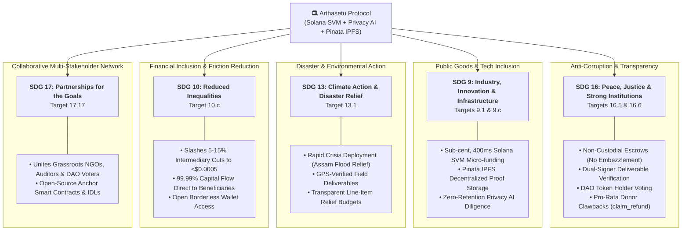

# 🌍 United Nations Sustainable Development Goals (SDGs) Alignment

> **Arthasetu (`अर्थसेतु`) Protocol**  
> *Leveraging Decentralized Smart Contract Escrows, On-Chain Governance, and Privacy-Preserving AI Diligence to Advance Global Sustainable Development.*

---

## 📑 Table of Contents
1. [Executive Summary](#1-executive-summary)
2. [Primary SDG Alignments](#2-primary-sdg-alignments)
   - [SDG 16: Peace, Justice, and Strong Institutions](#sdg-16-peace-justice-and-strong-institutions-primary)
   - [SDG 9: Industry, Innovation, and Infrastructure](#sdg-9-industry-innovation-and-infrastructure-primary)
   - [SDG 13: Climate Action & Disaster Resilience](#sdg-13-climate-action--disaster-resilience-primary)
   - [SDG 10: Reduced Inequalities & Remittance Friction](#sdg-10-reduced-inequalities--remittance-friction-primary)
   - [SDG 17: Partnerships for the Goals](#sdg-17-partnerships-for-the-goals-primary)
3. [Secondary Humanitarian Impact (SDG 6 & SDG 3)](#3-secondary-humanitarian-impact-sdg-6--sdg-3)
4. [Comparative Matrix: Traditional Aid vs. Arthasetu](#4-comparative-matrix-traditional-aid-vs-arthasetu)
5. [Measurable Impact Metrics (KPIs)](#5-measurable-impact-metrics-kpis)

---

## 1. Executive Summary

Traditional charity, humanitarian disaster relief, and public goods funding are plagued by **centralized opacity, embezzlement, high platform fees (5–15%), delayed disbursements, and lack of deliverable verification**.

The **Arthasetu Protocol** leverages the high-speed **Solana Virtual Machine (SVM)**, **Pinata Cloud IPFS**, and **Privacy-Preserving AI Diligence** to create a zero-corruption, transparent, milestone-governed funding infrastructure. By directly addressing systemic governance failures, Arthasetu advances several key **United Nations Sustainable Development Goals (SDGs)** for the 2030 agenda.

---

---

### SDG 16: Peace, Justice, and Strong Institutions (PRIMARY)

> **Goal 16**: *Promote peaceful and inclusive societies for sustainable development, provide access to justice for all, and build effective, accountable, and inclusive institutions at all levels.*

#### Key Targets Addressed:
* **Target 16.5**: *Substantially reduce corruption and bribery in all their forms.*
* **Target 16.6**: *Develop effective, accountable, and transparent institutions at all levels.*
* **Target 16.7**: *Ensure responsive, inclusive, participatory, and representative decision-making at all levels.*

#### How Arthasetu Implements SDG 16:
1. **Elimination of Single-Key Embezzlement**:
   * Traditional charities deposit donations into private bank accounts where funds can be misappropriated without oversight.
   * Arthasetu locks 100% of donor funds into **non-custodial Solana Program Derived Address (PDA) escrows**. No individual—not even the protocol creator or authority—can withdraw funds arbitrarily.
2. **Dual-Signer Milestone Accountability**:
   * Funds are released only in staged milestone tranches after deliverables are attested by both the **Campaign Creator** and a designated **Independent Field Verifier** (`propose_milestone`).
3. **Decentralized DAO Governance**:
   * The global community of token holders votes on proposals (`ApproveCampaign`, `ReleaseMilestone`, `EmergencyWithdraw`) with voting tokens locked in anti-flash-loan escrow accounts (`VoteEscrow`).
4. **Donor Clawback Recourse (Target 16.6)**:
   * If a project fails to deliver, the DAO triggers emergency fund protection, and donors can claw back their remaining funds pro-rata (`claim_refund`).

---

### SDG 9: Industry, Innovation, and Infrastructure (PRIMARY)

> **Goal 9**: *Build resilient infrastructure, promote inclusive and sustainable industrialization, and foster innovation.*

#### Key Targets Addressed:
* **Target 9.1**: *Develop quality, reliable, sustainable, and resilient infrastructure.*
* **Target 9.c**: *Significantly increase access to information and communications technology and strive to provide universal and affordable access.*

#### How Arthasetu Implements SDG 9:
1. **High-Performance Public Goods Rails**:
   * Built on the energy-efficient **Solana Virtual Machine (SVM)**, providing 400ms block finality and processing thousands of micro-donations per second.
2. **Decentralized Cryptographic Storage**:
   * Uses **Pinata Cloud IPFS** to permanently pin project whitepapers, disaster reports, supplier invoices, and GPS delivery logs, ensuring data immutability and censorship resistance.
3. **Privacy-Preserving Artificial Intelligence**:
   * Leverages in-memory, zero-retention AI models (Google Gemini 1.5 Flash) with PII sanitization to cross-examine project stories against technical documentation and budget spreadsheets, bringing institutional-grade diligence to grassroots initiatives.

---

### SDG 13: Climate Action & Disaster Resilience (PRIMARY)

> **Goal 13**: *Take urgent action to combat climate change and its impacts.*

#### Key Targets Addressed:
* **Target 13.1**: *Strengthen resilience and adaptive capacity to climate-related hazards and natural disasters in all countries.*
* **Target 13.b**: *Promote mechanisms for raising capacity for effective climate change-related planning and management.*

#### How Arthasetu Implements SDG 13:
1. **Rapid-Response Climate Disaster Crowdfunding**:
   * Climate catastrophes (such as the **Assam Flood Crisis**, coastal cyclones, and extreme droughts) require immediate capital deployment within 24–48 hours.
   * Arthasetu allows local humanitarian NGOs to launch climate relief campaigns in minutes, verified by automated AI document audits.
2. **Verifiable Environmental Deliverables**:
   * Relief teams upload verifiable evidence of climate adaptation work:
     * Motorized rescue rafts deployed in inundated riverine belts.
     * Tree replanting GPS coordinates and satellite tracking.
     * Solar mini-grid installations with on-chain performance logs.

---

### SDG 10: Reduced Inequalities & Remittance Friction (PRIMARY)

> **Goal 10**: *Reduce inequality within and among countries.*

#### Key Targets Addressed:
* **Target 10.c**: *By 2030, reduce to less than 3% the transaction costs of migrant remittances and eliminate remittance corridors with costs higher than 5%.*

#### How Arthasetu Implements SDG 10:
1. **Sub-Cent Global Transaction Costs**:
   * Traditional international wire transfers and crowdfunding intermediaries charge **5% to 15% in platform fees, foreign exchange spreads, and banking cuts**.
   * On Solana, stablecoin transfers cost **<$0.0005**, enabling 99.99% of donated capital to reach grassroots communities in developing nations.
2. **Financial Inclusion for Grassroots Creators**:
   * Anyone with a Solana wallet address can propose public goods initiatives without needing approval from legacy banking intermediaries or centralized credit scoring agencies.

---

### SDG 17: Partnerships for the Goals (PRIMARY)

> **Goal 17**: *Strengthen the means of implementation and revitalize the Global Partnership for Sustainable Development.*

#### Key Targets Addressed:
* **Target 17.17**: *Encourage and promote effective public, public-private, and civil society partnerships, building on the experience and resourcing strategies of partnerships.*

#### How Arthasetu Implements SDG 17:
1. **Multi-Stakeholder Verification Network**:
   * Connects **Grassroots NGOs (Creators)**, **Independent Auditing Bodies (Designated Verifiers)**, and **Global Backers (DAO Token Holders)** into an open, collaborative ecosystem.
2. **Open-Source Public Goods**:
   * All smart contracts, IDLs, and client libraries are open source under permissive licenses, enabling other Web3 protocols and public institutions to build atop Arthasetu.

---

## 3. Secondary Humanitarian Impact (SDG 6 & SDG 3)

For humanitarian and disaster response campaigns (e.g. Flood and Drought Relief):

* **SDG 6: Clean Water and Sanitation (Target 6.1)**:
  * Milestone roadmaps explicitly require and verify the distribution of gravity-fed water purifiers (e.g. 5,000 units in Assam flood relief), chlorine disinfection kits, and water quality testing certificates.
* **SDG 3: Good Health and Well-Being (Target 3.d)**:
  * Funds mobile medical outposts, antivenom procurement, and pediatric medications during post-disaster epidemics.

---

## 4. Comparative Matrix: Traditional Aid vs. Arthasetu

| Dimension | Traditional Charity / Web2 Crowdfunding | Arthasetu Protocol (Web3 + AI) | SDG Alignment |
| :--- | :--- | :--- | :--- |
| **Fund Custody** | Centralized bank account owned by single entity | Non-custodial Solana Escrow PDA | **SDG 16.5** |
| **Transaction Fees** | 5%–15% (Platform cut + Wire fees) | <$0.0005 per transaction (Solana SVM) | **SDG 10.c** |
| **Disbursement Model** | 100% upfront lump-sum (High risk of fraud) | Staged milestone tranches (Pay-on-delivery) | **SDG 16.6** |
| **Diligence & Audit** | Manual, slow, prone to biased rubber-stamping | Privacy-Preserving AI Story-Doc Cross-Check | **SDG 9.c** |
| **Proof of Delivery** | Unverified PDF newsletters months later | Cryptographic Pinata IPFS proofs (GPS, Invoices) | **SDG 16.6** |
| **Governance** | Closed board of directors | Open, on-chain DAO token holder voting | **SDG 16.7** |
| **Donor Recourse** | Zero refund capability if project fails | Pro-rata emergency refund clawbacks | **SDG 16.6** |
| **Speed to Fund** | 2–4 weeks for international grants | Instantaneous global stablecoin transfers | **SDG 13.1** |

---

## 5. Measurable Impact Metrics (KPIs)

The Arthasetu on-chain ledger allows real-time tracking of global SDG indicators:

1. **Capital Efficiency Ratio**: `% of donor funds delivered directly to on-ground beneficiaries` (Target: >99.5%).
2. **Fraud Prevention Rate**: `Escrow funds rescued and clawed back via EmergencyWithdraw proposals`.
3. **Verification Integrity Score**: `Average AI Trust Score and Designated Verifier attestation rate across campaigns`.
4. **Time-to-Relief Latency**: `Hours elapsed from disaster onset to funded escrow and first milestone deployment`.

---

*Arthasetu Protocol Documentation · Accelerating the United Nations Sustainable Development Goals.*
