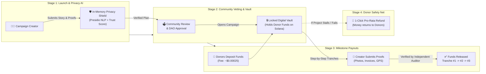
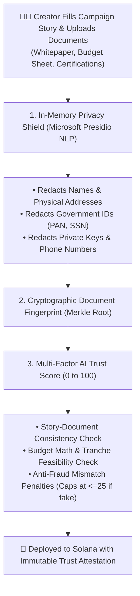
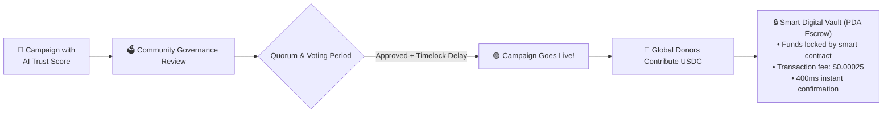
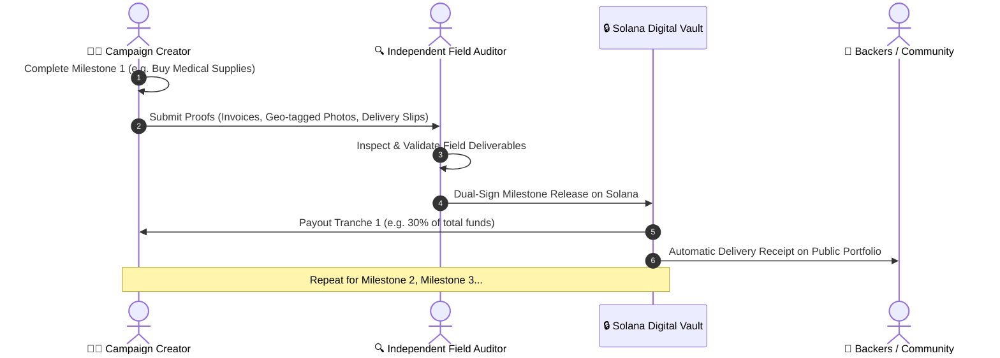
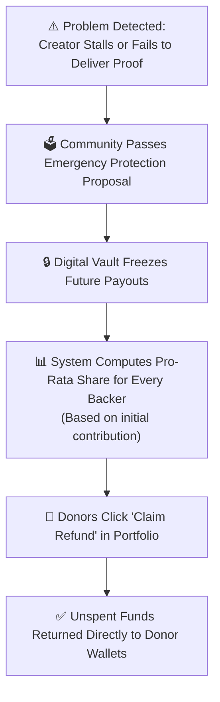

# 🧭 Arthasetu: Plain-English User Flow & Presentation Architecture Guide

> **A Human-Centric Guide, PPT Presentation Kit, and Step-by-Step User Journey Map designed for College Professors, Evaluators, Non-Crypto Audiences, and Everyday Users.**

---

## 📑 Table of Contents
1. [Executive Summary: What is Arthasetu in Plain English?](#1-executive-summary-what-is-arthasetu-in-plain-english)
2. [Plain-English Concept Translation Table](#2-plain-english-concept-translation-table)
3. [PPT Slide Deck Kit: System Architecture for Presentations](#3-ppt-slide-deck-kit-system-architecture-for-presentations)
   - [Slide 1: Single Master Architecture Diagram (The Big Picture)](#slide-1-single-master-architecture-diagram-the-big-picture)
   - [Slide 2: Stage 1 — Campaign Launch & In-Memory Privacy Shield](#slide-2-stage-1--campaign-launch--in-memory-privacy-shield)
   - [Slide 3: Stage 2 — Community Review & Non-Custodial Vault](#slide-3-stage-2--community-review--non-custodial-vault)
   - [Slide 4: Stage 3 — Milestone Proofs & Field Verification](#slide-4-stage-3--stage-3--milestone-proofs--field-verification)
   - [Slide 5: Stage 4 — Donor Safety Net & 100% Refund Guarantee](#slide-5-stage-4--donor-safety-net--100-refund-guarantee)
4. [The 4 Step-by-Step User Journeys](#4-the-4-step-by-step-user-journeys)
   - [Journey A: The Campaign Creator (NGO / Project Leader)](#journey-a-the-campaign-creator-ngo--project-leader)
   - [Journey B: The Everyday Donor (Supporter)](#journey-b-the-everyday-donor-supporter)
   - [Journey C: The Field Verifier (Auditor / Engineer)](#journey-c-the-field-verifier-auditor--engineer)
   - [Journey D: The Community Governance Voter (DAO Member)](#journey-d-the-community-governance-voter-dao-member)
5. [Professor & Judge Q&A / Glossary](#5-professor--judge-qa--glossary)

---

## 1. Executive Summary: What is Arthasetu in Plain English?

In traditional charity and crowdfunding (like GoFundMe or relief NGOs):
* **Problem 1 (Trust Deficit & Embezzlement)**: Once money is donated, it goes directly into an individual's private bank account. Donors have zero guarantee that the money actually builds the hospital, delivers the food rations, or buys medical kits.
* **Problem 2 (High Middleman Fees)**: Traditional payment gateways and international remittances take **5% to 15%** in transaction cuts. Donating $5 to a global disaster often costs more in fees than the donation itself.
* **Problem 3 (Privacy Risks)**: Uploading personal IDs, FCRA papers, or medical records to standard websites exposes sensitive personal data to leaks and cloud data-mining.

### The Arthasetu Solution
**Arthasetu (अर्थसेतु — *"The Bridge of Value"*)** is an intelligent, milestone-based crowdfunding platform built on the ultra-fast **Solana** network:
1. **Automated Privacy & Anti-Fraud Shield**: An intelligent AI engine automatically masks sensitive personal details (national IDs, phone numbers, addresses) in computer memory and cross-examines the project plan against financial budgets to generate a public **Trust Score (0–100)**.
2. **Digital Milestone Vault (Escrow)**: Donated money is never sent to the creator's personal wallet upfront. Instead, it is locked inside an automated **Digital Vault (Smart Contract)**.
3. **Pay-as-You-Deliver**: Funds are released in small step-by-step tranches (e.g. 25% for foundation, 25% for roof) only after an **independent field verifier** uploads proof of work (photos, GPS logs, invoices) and the community confirms delivery.
4. **1-Click Refund Guarantee**: If a project stalls or cheats, the remaining money locked in the vault is refunded directly to donors with a single click.

---

## 2. Plain-English Concept Translation Table

Use this reference table when presenting to professors or audiences who are unfamiliar with Web3/crypto terminology:

| Intimidating Crypto Term | Plain-English Analogy | Real-World Explanation |
| :--- | :--- | :--- |
| **Solana Blockchain (SVM)** | **Ultra-Fast Global Public Ledger** | A transparent digital ledger that processes transactions in 400 milliseconds for less than a tenth of a cent ($0.00025). |
| **Smart Contract (Anchor Program)** | **Automated Digital Agreement with Unbreakable Rules** | Computer code that acts like a strict vending machine: if the rules and proofs are satisfied, it releases funds automatically without human bribery. |
| **PDA Escrow Account** | **Digital Safety Deposit Box (Vault)** | A secure, tamper-proof digital safe owned only by the rules of the campaign—no single person can run away with the money. |
| **Microsoft Presidio NLP** | **Automated Privacy & Identity Shield** | An intelligent scanner that automatically detects and blacks out names, phone numbers, and government ID numbers before processing. |
| **Cryptographic Merkle Tree** | **Digital Document Fingerprint / Tamper Seal** | A mathematical fingerprint generated across all attached PDFs/spreadsheets so creators cannot secretly change their plans later. |
| **USDC Stablecoin** | **Digital Digital Dollars ($1.00)** | A 1:1 digital US Dollar used to prevent crypto price fluctuations during charity campaigns. |
| **DAO Governance & Timelock** | **Community Democratic Review & Cooling-Off Period** | Community token holders vote to approve campaigns, with a built-in safety waiting period to prevent hasty or fraudulent decisions. |

---

## 3. PPT Slide Deck Kit: System Architecture for Presentations

---

### Slide 1: Single Master Architecture Diagram (The Big Picture)

> **Slide Title**: *Arthasetu End-to-End System Architecture*  
> **Speaker Note**: *"Arthasetu consists of 4 simple stages: First, creators get privacy-screened and trust-scored; second, funds are deposited into a secure digital vault; third, money is unlocked only upon verified milestone delivery; and fourth, donors retain a 100% refund safety net."*



---

### Slide 2: Stage 1 — Campaign Launch & In-Memory Privacy Shield

> **Slide Title**: *Stage 1: AI-Powered Diligence & Zero-Leak Privacy*  
> **Speaker Note**: *"Before a campaign goes live, our hybrid AI scanner scrubs personal identity numbers in computer memory with zero cloud storage. It then checks if the budget matches the story and gives it a public Trust Score."*



---

### Slide 3: Stage 2 — Community Review & Non-Custodial Vault

> **Slide Title**: *Stage 2: Democratic Approval & Non-Custodial Storage*  
> **Speaker Note**: *"No single admin controls the money. The community inspects the AI audit and votes to approve the project. Once approved, all donor contributions go into a secure digital safe on Solana."*



---

### Slide 4: Stage 3 — Milestone Proofs & Field Verification

> **Slide Title**: *Stage 3: Pay-as-You-Deliver Milestone Verification*  
> **Speaker Note**: *"Instead of handing over 100% of the funds upfront, money is released in milestone tranches. The creator uploads evidence, an independent field auditor co-signs, and only then is the next tranche unlocked."*



---

### Slide 5: Stage 4 — Donor Safety Net & 100% Refund Guarantee

> **Slide Title**: *Stage 4: Fail-Safe Protection & Donor Clawback*  
> **Speaker Note**: *"If a creator disappears or fails to deliver milestone evidence, the community votes to trigger emergency protection. The remaining funds are never lost—every donor can reclaim their pro-rata share with one click."*



---

## 4. The 4 Step-by-Step User Journeys

---

### Journey A: The Campaign Creator (NGO / Project Leader)

```
[ Step 1: Basics ] ➔ [ Step 2: Storytelling ] ➔ [ Step 3: Privacy & AI Shield ] ➔ [ Step 4: Milestones ] ➔ [ Step 5: Launch ]
```

1. **Step 1 — Project Identity**: Enter project title, category (e.g. Climate, Healthcare, Education), target funding goal in USDC, and social links.
2. **Step 2 — Author Story**: Write a rich project narrative explaining the problem, solution, and roadmap using the live Markdown editor.
3. **Step 3 — Privacy Shield & Document Scanning**:
   * Drag-and-drop supporting whitepapers, itemized budget spreadsheets, or NGO registration certificates.
   * The **Microsoft Presidio Privacy Shield** scans text in volatile memory and redacts all personal names, phone numbers, and tax IDs.
   * The system computes a **Tamper-Proof Document Fingerprint** and generates a **Trust Score (0–100)**.
4. **Step 4 — Set Milestones & Appoint Verifier**: Split the budget into accountable milestones (e.g. Milestone 1: $15,000, Milestone 2: $20,000) and specify the wallet address of an independent verifier.
5. **Step 5 — Launch**: Sign with your wallet. The campaign is registered on Solana in review status.

---

### Journey B: The Everyday Donor (Supporter)

```
[ Step 1: Discover ] ➔ [ Step 2: Inspect Trust Score ] ➔ [ Step 3: Micro-Donate ] ➔ [ Step 4: Track or Refund ]
```

1. **Step 1 — Discover**: Browse active campaigns in `/explore` filtered by categories (Disaster Relief, Education, Open Source).
2. **Step 2 — Inspect Evidence**: Open the campaign page to inspect the **Trust Score badge**, sub-score breakdown (Authenticity, Story Alignment, Feasibility), and document fingerprint.
3. **Step 3 — 1-Click Micro-Donation**: Donate any amount (from $1 to $1,000+) in USDC. The transaction settles in 400 milliseconds with less than a tenth of a cent ($0.00025) in network fees.
4. **Step 4 — Real-Time Impact & Refunds**:
   * Track milestone completion in `/portfolio`.
   * Inspect verified evidence (invoices, photos) in the **Deliverable Proof Inspector**.
   * If a project fails to deliver, click **"Claim Pro-Rata Refund"** to withdraw unreleased funds directly back to your wallet.

---

### Journey C: The Field Verifier (Auditor / Engineer)

```
[ Step 1: Receive Proofs ] ➔ [ Step 2: Field Audit ] ➔ [ Step 3: Co-Sign on Solana ] ➔ [ Step 4: Release Tranche ]
```

1. **Step 1 — Review Evidence**: The creator uploads completion receipts, photos, and test reports to the `/verifier` portal.
2. **Step 2 — Audit & Field Cross-Examination**: The designated verifier cross-checks invoices and physical progress against milestone specifications.
3. **Step 3 — Co-Sign on Solana**: The verifier clicks **"Verify Deliverable"** and signs the transaction on Solana.
4. **Step 4 — Tranche Release**: Once verified and passed through governance, the smart vault releases that milestone's funds to the creator and closes the temporary milestone account to reclaim storage fees.

---

### Journey D: The Community Governance Voter (DAO Member)

```
[ Step 1: Review Proposal ] ➔ [ Step 2: Lock Tokens & Vote ] ➔ [ Step 3: Timelock Countdown ] ➔ [ Step 4: Execution ]
```

1. **Step 1 — Due Diligence**: Inspect pending campaign proposals and milestone release requests in `/governance`.
2. **Step 2 — Cast Vote**: Vote *For*, *Against*, or *Abstain*. Tokens are temporarily locked in vote escrow to prevent voter bribery or buy-vote-dump attacks.
3. **Step 3 — Timelock Cooling Period**: Once voting succeeds and quorum is reached, the proposal enters a mandatory timelock delay (e.g. 24–48 hours) to ensure complete transparency.
4. **Step 4 — Permissionless Execution**: Any member triggers execution, moving the campaign to live or paying out the verified milestone.

---

## 5. Professor & Judge Q&A / Glossary

### Frequently Asked Questions

#### Q1: "Why do we need blockchain instead of a normal SQL database?"
> **Answer**: In a normal database (like MySQL or AWS), a single company administrator can edit donor balances, modify campaign goals, or embezzle funds without anyone knowing. On Solana, the rules are enforced by **immutable smart contracts**. Neither the platform creator, nor the campaign creator, nor any hacker can alter the escrow rules or steal locked donor funds.

#### Q2: "How does the AI prevent someone from uploading a fake document?"
> **Answer**: Arthasetu's AI diligence engine doesn't just read words—it runs a **substantive Jaccard cross-consistency check** between the campaign story and the uploaded files. If someone creates a "Flood Relief Campaign" but uploads an unrelated software engineer resume, the Story-Document Alignment score drops to $\le 20\%$, and the system enforces a **strict mathematical bottleneck ceiling** that caps the Trust Score at **$\le 25/100$ (High Risk)**.

#### Q3: "What happens if a donor's personal private key or ID is in the document?"
> **Answer**: The **Microsoft Presidio NLP engine** extracts and blacks out names, government IDs, credit cards, and seed phrases in volatile computer memory before any data is processed or analyzed. No private data is ever saved to persistent disk or sent to external AI training models.

#### Q4: "Why Solana instead of Ethereum?"
> **Answer**: Ethereum transaction fees range from $\$2$ to $\$15+$, which means donating $\$5$ to a disaster fund is mathematically impossible due to fees. Solana charges **$\approx \$0.00025$** per transaction, enabling real-world micro-donations with instant 400ms settlement.

---

*Arthasetu Protocol Documentation · Built for Real-World Impact & Transparency on Solana.*
